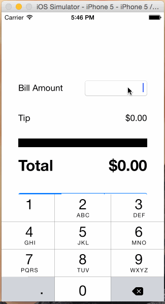

# Pre-work Tip Calculator for Codepath

This application is an exercise to complete the application to Codepath's iOS for Designers bootcamp.

## What does the app can do?

* [x] Required: The user can calculate the tip, using diferent percentages 
* [x] Optional: The user can opt to get a random tip, either by clicking the 'Surprise me' button or by shaking the device

Walkthrough of all the app stories:

The GIF was created with [LiceCap](http://www.cockos.com/licecap/).